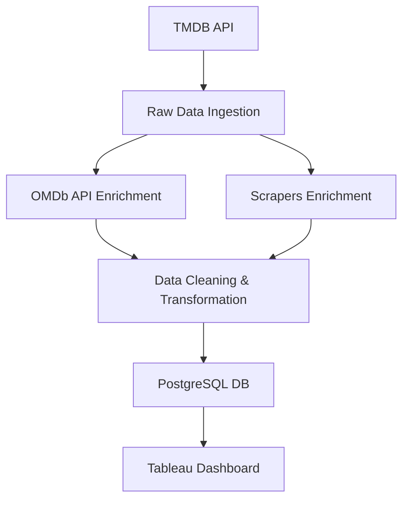

# 📺 TV Series ETL Pipeline 

## 1. Project Overview

This project aims to build a modular, scalable ETL pipeline that collects, processes, and stores high-quality metadata and ratings for top-ranked TV series. The pipeline will serve as a data foundation for future systems like recommendation engines and conversational agents (chatbots), and immediately support business analytics dashboards built in **Tableau**.

---

## 2. Objectives

- Fetch structured data on top-rated TV series from **TMDB**.
- Enrich metadata with **aggregated ratings** from APIs like **OMDb** (IMDb, Rotten Tomatoes, Metacritic).
- Store cleaned, well-modeled data in a **PostgreSQL** database.
- Create a **Tableau dashboard** for stakeholders to explore and analyze the data.
- Ensure the pipeline is **modular**, **monitorable**, and **future-ready** for machine learning applications.

---

## 3. Data Sources

| Source       | Purpose                              | Access Method            |
|--------------|--------------------------------------|---------------------------|
| TMDB API     | Fetch top-rated series and metadata  | REST API with pagination  |
| OMDb API     | Enrich with ratings                  | REST API with API Key     |
| Web Scraping | Rotten Tomatoes & Metacritic ratings | Selenium / Requests / BS4 |

---

## 4. System Architecture

### Tools & Stack

- **ETL Orchestration**: Apache Airflow on **Astronomer**
- **Database**: PostgreSQL
- **Data Transformations**: `dbt`
- **Dashboarding**: Tableau
- **Monitoring**:
  - **Airflow UI** for DAG execution tracking
  - **Grafana** dashboards for:
    - Task runtime, failure/success trends
    - Data quality validation (via Great Expectations)
    - PostgreSQL health metrics (row counts, nulls, freshness)
  - **Prometheus** or **StatsD** as Grafana data sources
  - Slack/Email alerts on pipeline failures or data anomalies
- **Containerization**: Docker (future CI/CD via GitHub Actions)

### High-Level Workflow

---

## 5. Database Design

### Tables

- **series**
  - `series_id` (PK), `title`, `release_year`, `genres`, `language`, `network`, `plot`
- **ratings**
  - `series_id` (FK), `imdb_rating`, `imdb_count`, `tomatoes_critic`, `tomatoes_critic_count`, `metacritic`, `metacritic_count`, `metauser`, `metauser_count`
- **genre_dim**, **network_dim** (for analytics efficiency)

> **Star schema** layout ensures performance for analytics and supports downstream ML integration.

---

## 6. Dashboard (Tableau)

### Key Dashboards

- Top-Rated Series by Platform
- Rating Distribution Across Genres
- Trends in Ratings Over Time
- Multi-Source Rating Comparison

### Features

- Filtering by genre, platform, year
- Drill-down to individual show profiles
- Auto-refresh from database (PostgreSQL)

---

## 7. ETL Pipeline Design

### Best Practices

- **Atomic and Idempotent Tasks**: Supports retries without corruption
- **Task Isolation**: Separate ingestion, transformation, enrichment
- **Monitoring & Alerts**: Grafana dashboards, Airflow logs, Slack/email alerts
- **Chunked Processing**: Batch API calls to avoid rate limits

### Data Quality

- **Great Expectations** for:
  - Non-null rating fields
  - Valid genre values
  - Correct score ranges (e.g., 0–10)

### Data Quality Monitoring with Grafana

- **Metrics Tracked:**
  - Row ingestion volume per run
  - Null percentage in key columns
  - Schema validation success rates
  - Timestamp-based data freshness

- **Architecture:**
  - Use **Prometheus** scrapers to collect metrics from:
    - Airflow DAGs (via exporters or StatsD)
    - PostgreSQL row counts and freshness queries
    - Great Expectations validation results
  - Visualized in **Grafana** with:
    - Daily pipeline health board
    - Data validation success/failure trends
    - Alert panel for anomalies (e.g. >10% null in `ratings`)

---

## 8. Future Readiness

- Pipeline designed to support future:
  - 📦 **Recommendation Systems** (content-based, collaborative filtering)
  - 🤖 **Chatbots** (search + personalized API serving)
- Stored features (e.g., genres, ratings) are ML-friendly
- Modular Airflow DAGs simplify onboarding new data sources or features

---

## 9. Assumptions & Constraints

- OMDb API rate limits may require caching
- TMDB pagination caps top-rated shows (~500 entries)
- Tableau licensing and data connectors must be pre-configured
- Prometheus/Grafana monitoring requires containerized exporter setup

---

## 10. Stakeholders

| Stakeholder       | Role                          |
|-------------------|-------------------------------|
| Data Engineers    | Build and maintain ETL        |
| BI Analysts       | Explore Tableau dashboards    |
| Product Managers  | Define KPIs and priorities    |
| ML Engineers      | Consume cleaned data later    |
| DevOps Engineers  | Maintain observability tools  |

---

## 11. Success Criteria

- ✅ Weekly updated and validated TV series data in PostgreSQL
- ✅ Functional Tableau dashboard for stakeholder exploration
- ✅ Reliable, monitorable Airflow DAGs with Grafana alerts
- ✅ Modular ETL design ready for ML/AI systems

---
