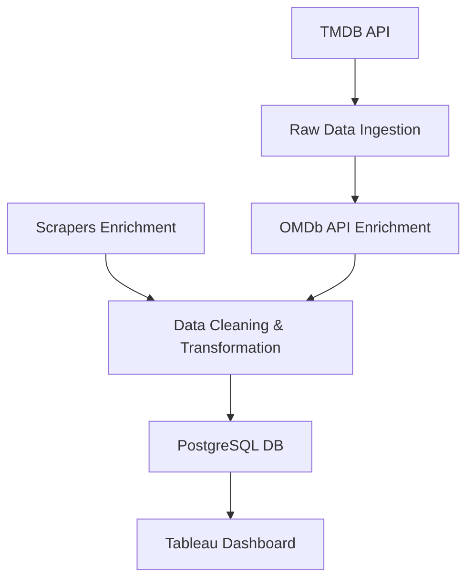

# 📺 TV Series ETL Pipeline  
## Business Requirements Document (BRD)

---

### 1. Project Overview

This project builds a scalable, modular ETL pipeline to extract, enrich, and store high-quality TV series metadata and ratings. It supports Tableau dashboards for stakeholders and is future-ready for recommendation engines and conversational agents.

---

### 2. Objectives

- Fetch structured data from TMDB  
- Enrich metadata with OMDb and scrapers (IMDb, Rotten Tomatoes, Metacritic)  
- Store cleaned data in PostgreSQL  
- Create interactive Tableau dashboards  
- Ensure modular, monitorable, and ML-ready pipeline  

---

### 3. Data Sources

| Source       | Purpose                  | Access Method         |
|--------------|--------------------------|------------------------|
| TMDB API     | Fetch top-rated series   | REST API              |
| OMDb API     | Rating enrichment        | REST API + API Key    |
| Web Scraping | Additional critics rating| Selenium/BS4/Requests |

---

### 4. System Architecture

Tools used: Airflow (on Astronomer), PostgreSQL, dbt, Tableau, Docker, Slack, Great Expectations.

---

### 5. Database Design

Star schema optimized for analytics and ML use:

- **series**: series_id (PK), title, release_year, genres, language, network, plot  
- **ratings**: `series_id` (FK), `imdb_rating`, `imdb_count`, `tomatoes_critic`, `tomatoes_critic_count`, `metacritic`, `metacritic_count`, `metauser`, `metauser_count`, `start_date`, `end_date`, `is_current`
- **genre_dim**, **network_dim**   

---

### 6. Tableau Dashboard

- Top-rated series by platform  
- Ratings by genre and over time  
- Multi-source comparisons  
- Filters by genre/year; drill-down view  

---

### 7. ETL Pipeline Design

- Atomic, idempotent, and chunked ingestion  
- Task isolation: ingestion, transformation, enrichment  
- Monitoring via Airflow logs and Slack alerts  
- Validation with Great Expectations (nulls, range, format)

---

### 8. Slowly Changing Dimensions (SCD)

Ratings data evolves over time. To track rating changes, the project implements **Slowly Changing Dimension Type 2 (SCD2)**:

- Historical values preserved for time-based analysis  
- Ratings table includes:
  - Surrogate key
  - Effective/expiry timestamps
  - Version numbers  

This enables trend monitoring and supports longitudinal reporting.

---

### 9. Future Readiness

- Recommendation engines (collaborative, content-based)  
- Conversational search and bots  
- Easily extendable DAGs for more sources  

---

### 10. Assumptions & Constraints

- OMDb rate limits exist; batching or caching may be needed  
- TMDB API pagination limited to ~500 results  
- Tableau access credentials must be configured  

---

### 11. Stakeholders

| Stakeholder       | Role                          |
|-------------------|-------------------------------|
| Data Engineers    | Build and maintain pipeline   |
| BI Analysts       | Analyze and visualize data    |
| Product Managers  | Define requirements and KPIs  |
| ML Engineers      | Use features for model training|

---

### 12. Success Criteria

- Weekly refreshed data and dashboards  
- Tableau insights align with stakeholder KPIs  
- Airflow DAGs modular, logged, and monitored  
- ML- and SCD-ready database powering advanced use cases  

---
